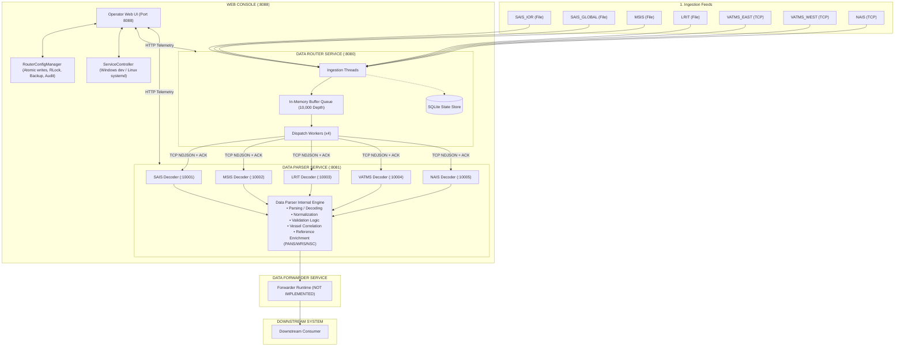
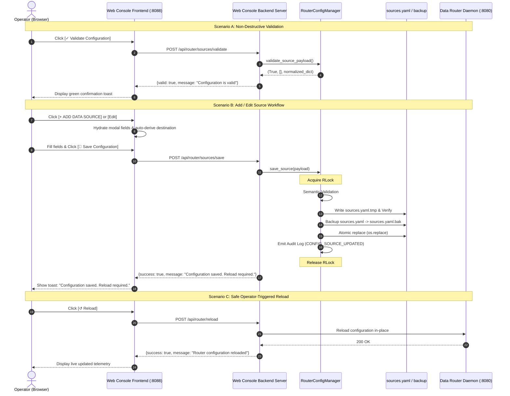

# Validation Web Console — Operator Console Walkthrough & Visual Diagrams

This document illustrates the upgraded Validation Web Console operator interface, the 3-service pipeline architecture, the safe configuration management workflows, and UI control layouts.

---

## 1. System Pipeline Architecture



---

## 2. Operator Console Layout Diagram

```
+-------------------------------------------------------------------------------------------------------+
|  VALIDATION MARITIME OPERATIONS CONSOLE                             2026-09-17 10:20:00 UTC  [REFRESH]|
+-------------------------------------------------------------------------------------------------------+
| SIDEBAR      | DATA ROUTER OPERATIONAL CONSOLE                                                        |
|              |                                                                                        |
| Dashboard    | [Router Status: RUNNING]  [Throughput: 0.0 msg/s]  [Queue: 0 / 10000]  [ACKed: 0]      |
|              |                                                                                        |
| 1. Router *  | OPERATIONAL TOOLBARS:                                                                  |
| 2. Parser    | +---------------------+  +---------------------+  +---------------------+              |
| 3. Forwarder | | SERVICE CONTROL     |  | CONFIGURATION       |  | VIEW                |              |
|              | | [> Start] [■ Stop]  |  | [↺ Reload]          |  | [↻ Refresh]         |              |
| System       | | [⟳ Restart]         |  | [✓ Validate Config] |  |                     |              |
| Logs         | +---------------------+  +---------------------+  +---------------------+              |
|              |                                                                                        |
|              | DATA SOURCES                                                       [+ ADD DATA SOURCE] |
|              | +------------------------------------------------------------------------------------+ |
|              | | Source      | Enbl | Type | Input Config      | Parser | Destination | Status | Act| |
|              | |-------------+------+------+-------------------+--------+-------------+--------+----+ |
|              | | SAIS_IOR    | ENBL | FILE | folder: SAIS_IOR  | SAIS   | :10001      | ACTIVE | Edit |
|              | | SAIS_GLOBAL | ENBL | FILE | folder: SAIS_GLOB | SAIS   | :10001      | ACTIVE | Edit |
|              | | MSIS        | ENBL | FILE | folder: MSIS      | MSIS   | :10002      | ACTIVE | Edit |
|              | | LRIT        | ENBL | FILE | folder: LRIT      | LRIT   | :10003      | ACTIVE | Edit |
|              | | VATMS_EAST  | ENBL | TCP  | 127.0.0.1:20001   | VATMS  | :10004      | ACTIVE | Edit |
|              | | VATMS_WEST  | DISA | TCP  | 127.0.0.1:20002   | VATMS  | :10004      | DISABL | Edit |
|              | | NAIS        | DISA | TCP  | 127.0.0.1:20003   | NAIS   | :10005      | DISABL | Edit |
|              | +------------------------------------------------------------------------------------+ |
+-------------------------------------------------------------------------------------------------------+
```

---

## 3. Configuration Management & Validation Lifecycle



---

## 4. Dangerous Operation Safety Flow

```mermaid
stateDiagram-v2
    [*] --> OperatorClick: Operator clicks [■ Stop], [⟳ Restart], [Disable], or [Delete]
    OperatorClick --> InterceptModal: Intercepted by Confirmation Modal
    
    state InterceptModal {
        [*] --> WarningState: Display explicit hazard warning & entity name
        WarningState --> CancelClicked: Click [Cancel] or [✕]
        WarningState --> ConfirmClicked: Click [Confirm Action]
    }
    
    CancelClicked --> Aborted: No backend request emitted; UI restored
    ConfirmClicked --> ExecuteAction: Call backend API
    ExecuteAction --> AuditLogged: Emit audit log event
    AuditLogged --> SuccessToast: Display success toast & refresh telemetry
    SuccessToast --> [*]
    Aborted --> [*]
```


